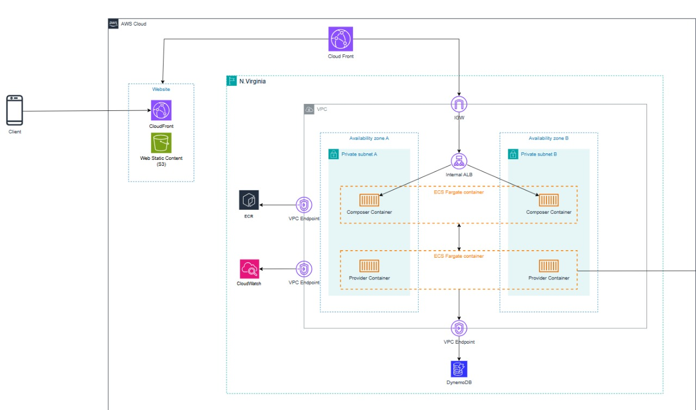

Secure, scalable infrastructure and CI/CD pipelines for a private cloud-native system:
ECS Fargate for containerized API services
Application Load Balancer (ALB) and API Gateway (REST & GraphQL) for routing,DynamoDB 

